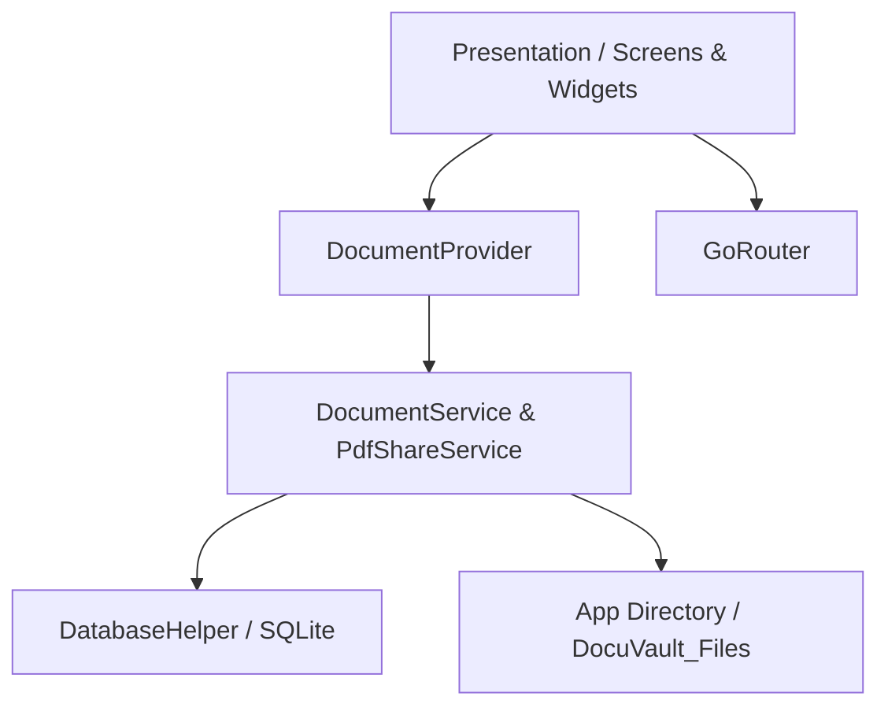

# 📄 DocuVault — Intelligent Document Management & Scanner App

<p align="center">
  
</p>

<p align="center">
  <b>A modern, high-performance Flutter application for capturing, enhancing, organizing, and securing physical and digital documents on mobile devices.</b>
</p>

<p align="center">
  
  
  
  
  
  
</p>

---

## 📌 Table of Contents

- [Overview](#-overview)
- [Key Features](#-key-features)
- [Architecture & Tech Stack](#-architecture--tech-stack)
- [Project Directory Structure](#-project-directory-structure)
- [Database Schema & Storage](#-database-schema--storage)
- [Screens & User Workflow](#-screens--user-workflow)
- [Getting Started & Installation](#-getting-started--installation)
- [Platform Permissions Setup](#-platform-permissions-setup)
- [Future Enhancements](#-future-enhancements)
- [Contributing](#-contributing)
- [License](#-license)

---

## 🌟 Overview

**DocuVault** is an all-in-one mobile document scanner and vault application engineered with Flutter. It streamlines the physical-to-digital document lifecycle:
1. **Capturing** high-resolution camera feeds or importing files from the device gallery.
2. **Auto-detecting** boundaries and allowing manual quad cropping with an interactive magnifier loupe.
3. **Enhancing** image quality using hardware-accelerated color matrices (e.g. Magic Color, Clean Paper, B&W, High Contrast).
4. **Exporting & Sharing** instantly as high-fidelity A4 PDF documents.
5. **Managing & Archiving** locally in an isolated encrypted vault with SQLite indexing, live search, favorites tagging, and storage diagnostics.

---

## ✨ Key Features

### 📷 Smart Document Scanner & Camera HUD
* **Live Camera Interface**: Custom camera viewfinder with leveler grid, laser scan animation, shutter flash effect, and flash toggle.
* **Google ML Kit Document Scanner Integration**: Hardware-accelerated auto-capture, document angle correction, and boundary recognition.
* **Batch & Single-Page Scanning**: Flexible capture modes for single vouchers or multi-page paper bundles.
* **Gallery Import**: Direct import from image gallery with automated redirection to crop and enhancement filters.

### ✂️ Precision Edge Detection & Manual Cropping
* **Automated Contour Detection**: Fast heuristic algorithm that detects document edges against background surfaces.
* **8-Point Draggable Bounding Handles**: Fine-tune corners and side anchors with ease.
* **Precision Loupe Magnifier**: Interactive magnification window showing pixel-accurate details under the user's fingertip.
* **Orientation Controls**: Rotate clockwise/counter-clockwise in 90° increments before persisting.

### 🎨 Document Processing Filters
* **Magic Color (Enhanced)**: Lifts contrast, increases text sharpness, and restores color balance.
* **Clean Document (White Paper)**: Cleans gray or shaded paper backgrounds to pure white while darkening printed/handwritten text.
* **Black & White**: Clean binary thresholding ideal for contracts, receipts, and printing.
* **Grayscale**: Smooth 8-bit monochromatic conversion.
* **High Contrast**: Accentuates dark inks while suppressing low-light noise.
* **Warm Sepia & Inverted**: Specialized tone adaptations for reading and blueprint reviews.

### 📑 Instant PDF Conversion & Native Sharing
* **A4 Standard Formatting**: Automatic aspect-ratio detection (Portrait vs. Landscape) conforming to standard A4 specifications.
* **Native System Share Sheet**: Share documents as `.pdf` directly to WhatsApp, Telegram, Email, Google Drive, AirDrop, and more using `share_plus`.
* **Zero Cloud Dependency**: 100% on-device PDF generation for total privacy.

### 🗄️ Robust Vault & Offline Storage
* **SQLite Database**: Fast, indexed database storage managing document IDs, names, file paths, file sizes, timestamps, and favorite flags.
* **Isolated File System**: Permanent copy stored within application sandbox directory (`DocuVault_Files`).
* **Optimistic UI Updates**: Instant favorite star/unstar toggling with automatic state rollback on failure.
* **Instant Search & Categorization**: Real-time filtering by keyword and file type across all documents or favorites.
* **Live Storage Diagnostics**: Track exact disk utilization, total item counts, and formatted storage sizes (B, KB, MB, GB).

---

## 🏗️ Architecture & Tech Stack

DocuVault follows a clean, layered architectural pattern:
* **Presentation Layer**: Responsive screens, stateful/stateless widgets, dialogs, and custom camera overlays.
* **State Management Layer**: Provider pattern (`ChangeNotifier`) with `DocumentProvider` maintaining single source of truth.
* **Service Layer**: Decoupled services for database querying (`DocumentService`) and PDF rendering/sharing (`PdfShareService`).
* **Data Access Layer**: Singleton SQLite instance (`DatabaseHelper`) managing schema versions, migrations, and CRUD transactions.



### Core Libraries & Dependencies

| Dependency | Version | Purpose |
|---|---|---|
| [`flutter`](https://flutter.dev) | SDK | Cross-platform UI toolkit |
| [`provider`](https://pub.dev/packages/provider) | `^6.1.1` | Reactive state management |
| [`go_router`](https://pub.dev/packages/go_router) | `^18.0.1` | Declarative routing and deep linking |
| [`sqflite`](https://pub.dev/packages/sqflite) | `^2.4.2` | Local SQLite database persistence |
| [`camera`](https://pub.dev/packages/camera) | `^0.12.1` | Direct camera access & viewfinder streaming |
| [`google_mlkit_document_scanner`](https://pub.dev/packages/google_mlkit_document_scanner) | `^0.6.1` | Machine Learning document scanning & edge detection |
| [`image_picker`](https://pub.dev/packages/image_picker) | `^1.2.3` | System gallery image picker |
| [`image`](https://pub.dev/packages/image) | `^4.1.7` | Pure Dart image decoding, cropping, and rotation |
| [`pdf`](https://pub.dev/packages/pdf) | `^3.13.0` | On-device PDF generation & formatting |
| [`share_plus`](https://pub.dev/packages/share_plus) | `^13.3.0` | Native OS share dialog integration |
| [`path_provider`](https://pub.dev/packages/path_provider) | `^2.1.5` | Access to filesystem directories (Documents, Cache) |
| [`google_fonts`](https://pub.dev/packages/google_fonts) | `^8.2.1` | Modern typography (Nunito) |

---

## 📂 Project Directory Structure

```text
document_management_app/
├── android/                    # Android native configuration & manifests
├── assets/
│   └── images/                 # App logo, icon, and profile placeholder assets
├── ios/                        # iOS native configuration & Info.plist
├── lib/
│   ├── core/                   # Application constants & design tokens
│   │   ├── app_color.dart      # Color schemes & palettes
│   │   ├── app_images.dart     # Asset path bindings
│   │   └── app_strings.dart    # Centralized UI text strings
│   ├── database/
│   │   └── database_helper.dart# SQLite singleton, tables, migrations
│   ├── model/
│   │   └── database_model.dart # DocumentModel data class & serialization
│   ├── provider/
│   │   └── document_provider.dart # ChangeNotifier state for documents, search, storage
│   ├── router/
│   │   └── app_router.dart     # GoRouter route declarations & navigation
│   ├── screens/
│   │   ├── document/           # All Documents screen with filter tabs & search
│   │   ├── DocumentScanner/    # Scanner viewfinder, crop screen, preview screen
│   │   │   ├── document_crop_screen.dart     # 8-point manual edge cropping & loupe
│   │   │   ├── document_scanner_screen.dart  # Camera viewfinder & ML Kit integration
│   │   │   ├── scanned_preview_screen.dart   # Filter previews, rotate, and save flow
│   │   │   └── scanner_frame_pointer.dart    # Custom painter for HUD viewfinder
│   │   ├── fovorite/           # Starred / Favorite documents screen
│   │   ├── header/             # Reusable screen header component
│   │   ├── home/               # Dashboard with quick actions & recent files
│   │   ├── settings/           # Vault stats, security toggles, preferences
│   │   └── splash/             # Animated brand splash screen
│   ├── service/
│   │   ├── database_service.dart # Repository layer for DB CRUD operations
│   │   └── pdf_share_service.dart# PDF conversion and sharing service
│   ├── widgets/
│   │   ├── custom_bottom_bar.dart      # Persistent navigation bar
│   │   ├── document_card.dart          # List view document card with quick actions
│   │   └── document_preview_dialog.dart# Fullscreen preview dialog with zoom & share
│   └── main.dart               # App entrypoint initializing Provider & GoRouter
├── pubspec.yaml                # Project metadata, dependencies, assets
└── README.md                   # Project documentation
```

---

## 🗃️ Database Schema & Storage

The app stores document metadata in an SQLite database file named `document_manager.db` managed by `DatabaseHelper`.

### `documents` Table

| Column Name | Data Type | Constraints | Description |
|---|---|---|---|
| `id` | `INTEGER` | `PRIMARY KEY AUTOINCREMENT` | Unique identifier |
| `name` | `TEXT` | `NOT NULL` | User-assigned or auto-generated title |
| `file_path` | `TEXT` | `NOT NULL` | Absolute filesystem path inside sandbox |
| `file_type` | `TEXT` | `NOT NULL` | Document format (`PDF`, `PNG`, `Image`, etc.) |
| `file_size` | `INTEGER` | `NOT NULL` | Physical file size in bytes |
| `is_favorite` | `INTEGER` | `NOT NULL DEFAULT 0` | Favorite flag (`1` for true, `0` for false) |
| `created_at` | `TEXT` | `NOT NULL` | ISO 8601 creation timestamp |
| `updated_at` | `TEXT` | `NOT NULL` | ISO 8601 last modified timestamp |

> **Filesystem Note**: Physical files are safely copied to the app's sandboxed document directory (`DocuVault_Files`). When a document is deleted via the app, both its database record and physical disk file are permanently removed.

---

## 📱 Screens & User Workflow

```
[ Splash Screen ] 
       │
       ▼
 [ Home Screen ] ──────────────┬───────────────────┐
       │                       │                   │
       ▼ (Scan)                ▼ (Upload)          ▼
[ Document Scanner ]    [ Gallery Picker ]   [ All Documents / Favorites ]
       │                       │                   │
       └───────────┬───────────┘                   ▼
                   ▼                     [ Document Preview Modal ]
       [ Document Crop Screen ]                    │
       (8-point quad adjust)                       ├──> Rename Document
                   │                               ├──> Toggle Favorite
                   ▼                               ├──> Share as PDF
       [ Scanned Preview Screen ]                  └──> Delete Document
       (Color Filters & Rotate)
                   │
                   ▼ (Save)
        [ Saved to SQLite Vault ]
```

1. **Splash Screen (`/splashScreen`)**: Displays an animated brand identity and initializes SQLite data before navigating to Home.
2. **Home Screen (`/home`)**: Dashboard displaying greeting, global search input, **Scan Document** and **Upload File** action cards, and a carousel of recently scanned documents.
3. **Document Scanner (`/documentScanner`)**: Provides live camera HUD overlay with flash toggles, single/batch modes, and Google Document Scanner triggers.
4. **Crop Screen**: Allows users to fine-tune document corners using draggable anchors with a real-time magnifying loupe.
5. **Preview Screen**: Allows applying image enhancements (Enhanced, Clean Document, B&W, Grayscale, etc.), rotating, and naming the document.
6. **Documents Screen (`/document`)**: Comprehensive file browser with filtering tabs (`All`, `Images`, `Favorites`), item counters, and search.
7. **Favorites Screen (`/favorite`)**: Quick-access collection of starred documents.
8. **Settings Screen (`/settings`)**: Displays real-time database storage metrics, security preferences, scan quality settings, and app versioning.

---

## 🚀 Getting Started & Installation

### Prerequisites

Ensure you have the following installed on your machine:
* [Flutter SDK](https://docs.flutter.dev/get-started/install) (`v3.12.0` or higher)
* [Dart SDK](https://dart.dev/get-dart) (`v3.12.0` or higher)
* [Android Studio](https://developer.android.com/studio) / Xcode (for iOS builds)
* An Android or iOS physical device or emulator with camera support

### Clone & Run

1. **Clone the repository:**
   ```bash
   git clone https://github.com/Gautam-Vaja/Document_Management_App.git
   cd Document_Management_App
   ```

2. **Install project dependencies:**
   ```bash
   flutter pub get
   ```

3. **Verify Flutter environment:**
   ```bash
   flutter doctor
   ```

4. **Launch the application:**
   ```bash
   # Run on connected Android / iOS device
   flutter run
   ```

---

## 🔒 Platform Permissions Setup

### Android (`android/app/src/main/AndroidManifest.xml`)
The following permissions and camera features are configured:

```xml
<manifest xmlns:android="http://schemas.android.com/apk/res/android">
    <uses-permission android:name="android.permission.CAMERA" />
    <uses-feature android:name="android.hardware.camera" android:required="false" />
    <uses-feature android:name="android.hardware.camera.autofocus" android:required="false" />
</manifest>
```

### iOS (`ios/Runner/Info.plist`)
Ensure camera and photo library usage descriptions are added when targeting iOS:

```xml
<key>NSCameraUsageDescription</key>
<string>DocuVault requires camera access to scan physical documents.</string>
<key>NSPhotoLibraryUsageDescription</key>
<string>DocuVault requires photo library access to import documents and images.</string>
```

---

## 🔮 Future Enhancements

- [ ] **On-Device OCR (Optical Character Recognition)**: Extract text from scanned documents using Google ML Kit Text Recognition.
- [ ] **Multi-Page PDF Merging**: Combine batch scan sessions into a single, multi-page PDF document.
- [ ] **Biometric App Lock**: Fingerprint and Face ID authentication before unlocking the vault.
- [ ] **Cloud Backup & Sync**: Encrypted Google Drive / OneDrive backup integration.
- [ ] **Document Tagging & Folders**: Custom categories, colored tags, and folder hierarchies.

---

## 🤝 Contributing

Contributions, issues, and feature requests are welcome!

1. Fork the Project
2. Create your Feature Branch (`git checkout -b feature/AmazingFeature`)
3. Commit your Changes (`git commit -m 'Add some AmazingFeature'`)
4. Push to the Branch (`git push origin feature/AmazingFeature`)
5. Open a Pull Request

---

## 📄 License

This project is licensed under the **MIT License** — see the [LICENSE](LICENSE) file for details.

---

<p align="center">
  Crafted with ❤️ using <b>Flutter</b>
</p>
